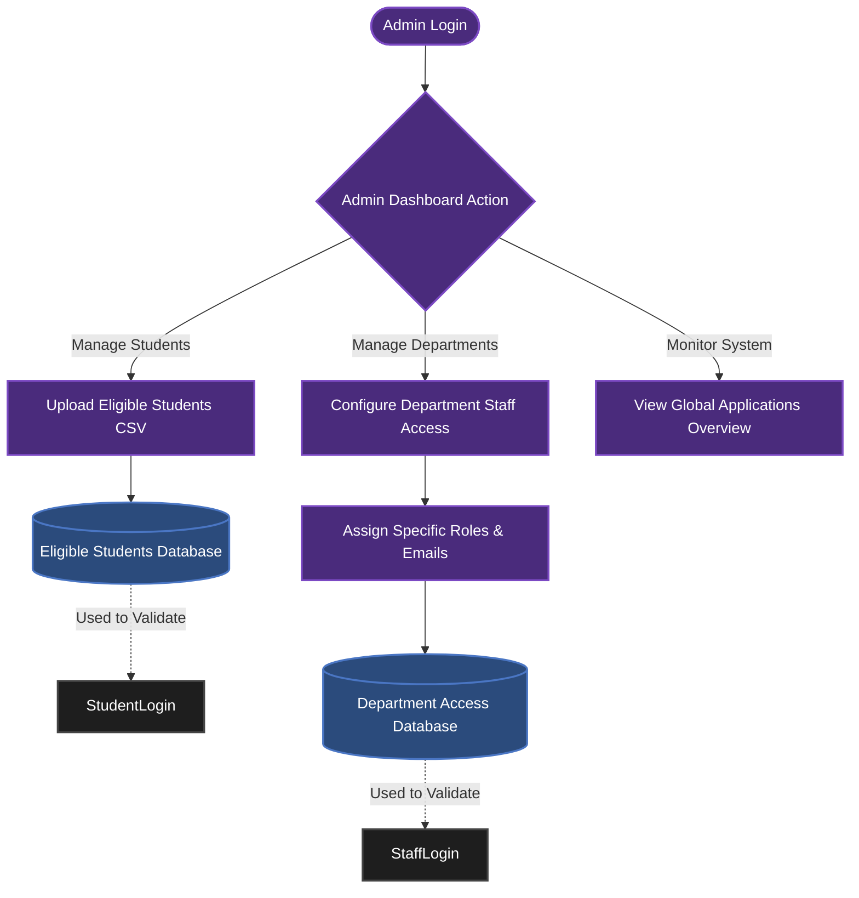
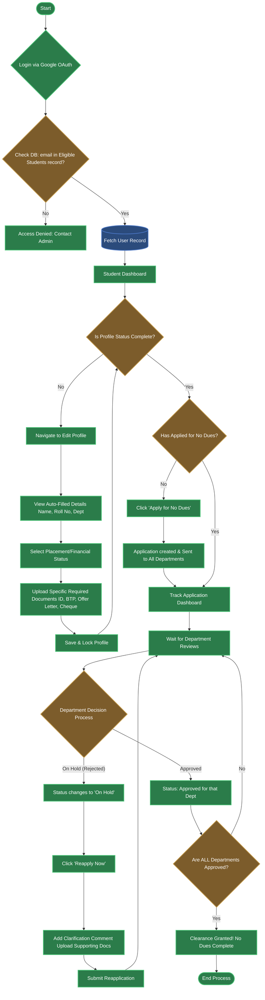
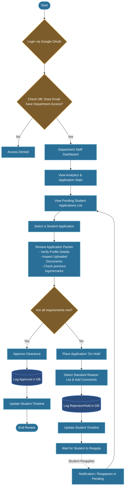
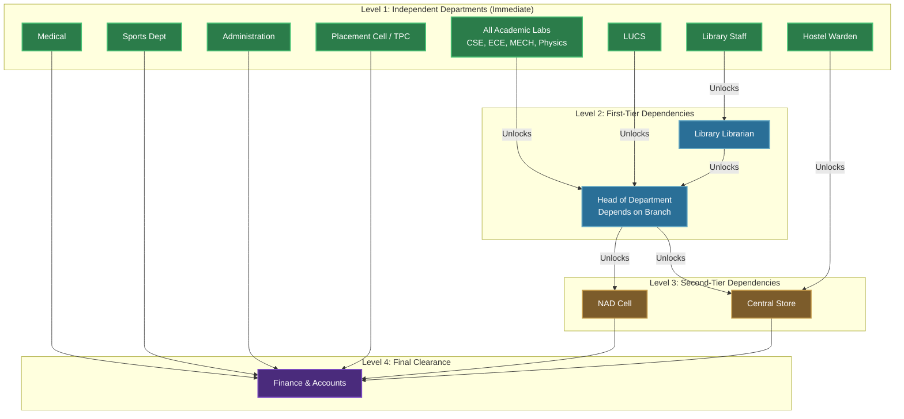

# LNMIIT No Dues Application Workflow Flowcharts

Here are the flowcharts detailing the core architecture and user journeys of the No Dues portal you built. You can attach these directly into your project report. Most modern markdown editors (like Notion, GitHub, and Obsidian) will automatically render these Mermaid diagrams.

## 1. System Initialization & Admin Setup Flow
This shows how the system is seeded with data so that users can actually use it.

---

## 2. Complete Student Lifecycle Journey
This is the core flow showing how a student gets onto the platform, completes their profile, applies, and handles rejections based on the business logic we implemented.

---

## 3. Department Staff Clearance Protocol
This shows how department coordinators (like Library, HOD, TPC) process incoming applications.

---

## 4. Departmental Clearance Hierarchy (Level-by-Level)
This flowchart details the exact dependency graph when a No Dues application is submitted. Some departments can approve immediately (Level 1), while others wait until their specific prerequisites are met (Level 2, 3, 4).

