# LNMIIT No Dues Portal

> ✅ **Successfully piloted in production during the senior batch convocation, processing 200+ student clearance requests.**

A web portal where final-year students of **The LNM Institute of Information Technology (LNMIIT)**
get their **No Dues clearance** online instead of carrying a paper form from office to office.

A student fills one profile and applies once. Every department (labs, library, hostel warden,
sports, medical, placement, LUCS, administration, HOD, NAD cell, store and accounts) clears the
application or puts it **On Hold** from its own dashboard. When every department has cleared it,
the student downloads the filled **No Dues certificate** (the institute's paper form, generated as a PDF).

| | |
|---|---|
| **Live site** (Vercel) | https://no-dues-gravity.vercel.app |
| **API** (Render) | https://noduesgravity.onrender.com/api (health check: `/api/health`) |
| **Stack** | MongoDB Atlas · Express 4 · React 19 · Node.js (MERN) · Tailwind CSS 4 · Vite 7 |
| **Sign-in** | Google (LNMIIT accounts) → our own JWT |
| **File storage** | Cloudinary |

> Every diagram in this README is written in [Mermaid](https://mermaid.js.org/). GitHub draws them
> automatically; in VS Code install a Mermaid preview extension.
> Each diagram is followed by a short box: **what it shows**, **why it matters** and **how to read it**.

---

## Table of contents

1. [What the portal does](#1-what-the-portal-does)
2. [Who uses it (roles)](#2-who-uses-it-roles)
3. [System architecture](#3-system-architecture)
4. [Backend architecture](#4-backend-architecture)
5. [Frontend architecture](#5-frontend-architecture)
6. [Database design (ER diagram)](#6-database-design-er-diagram)
7. [Departments, unit codes and permissions](#7-departments-unit-codes-and-permissions)
8. [The clearance workflow (dependency graph)](#8-the-clearance-workflow-dependency-graph)
9. [State machines](#9-state-machines)
10. [Flows](#10-flows)
11. [Business rules](#11-business-rules)
12. [API reference](#12-api-reference)
13. [Security](#13-security)
14. [The No Dues certificate](#14-the-no-dues-certificate)
15. [Project structure (every file)](#15-project-structure-every-file)
16. [Running locally](#16-running-locally)
17. [Environment variables](#17-environment-variables)
18. [Deployment](#18-deployment)
19. [Maintenance scripts](#19-maintenance-scripts)
20. [Troubleshooting](#20-troubleshooting)
21. [Known limitations and future work](#21-known-limitations-and-future-work)
22. [Glossary](#22-glossary)
23. [Contributors](#23-contributors)

---

## 1. What the portal does

**The old paper process:** a student prints the No Dues form, visits more than ten offices, and
waits for a signature at each one. Some signatures can only be collected after others (the HOD
signs only after the labs and library, and Accounts signs last). Nobody can see where a form is stuck.

**The portal:**

- **Admin** loads the list of students who may apply and gives staff access to their sections.
- **Student** signs in with Google, fills one profile (hostel, placement, library, club/fest roles,
  bank details for the caution-money refund) and uploads the documents. Then they click **Apply**.
- The backend creates **one clearance step per department** for that student
  (39 steps, or 40 for ECE students). Steps that depend on others start **Locked** and open by themselves when
  their prerequisites are approved.
- Each **department** sees only its own queue. It can **Approve** or **Put On Hold** with a reason
  and details, and sees only the profile fields and documents it needs.
- A student whose application is on hold sees why, may correct the profile, and **Reapplies** with
  an optional comment and proof document. Only the departments concerned review it again.
- When every step is approved, the application is **Completed**. It is then final and the
  certificate PDF becomes available on the student's Profile page.
- The **Admin dashboard** shows live numbers, where each application is waiting, and who put it on hold.

---

## 2. Who uses it (roles)

| Role | Signs in as | Lands on | Can do |
|---|---|---|---|
| **Student** | "Student" on the login page; must be on the Eligible Students list | `/student` | Fill/edit profile (before applying or while On Hold), apply, track, reapply, download certificate |
| **Department staff** | Their section (e.g. "Medical", "HOD - CSE", "Labs - MECH") | `/medical`, `/hod/cse`, `/labs/mech`… | See pending / approved / on-hold students of their section, view the permitted details, approve, bulk approve, put on hold, move a held student to approved, manage who else has access to their section |
| **Admin** | "Admin" | `/admin` | Manage eligible students (single, CSV, bulk remove), manage every staff member's access, dashboard, all applications. Can open every department dashboard |

One person can hold several permission codes, e.g. `["library_staff", "library_librarian"]`.

---

## 3. System architecture

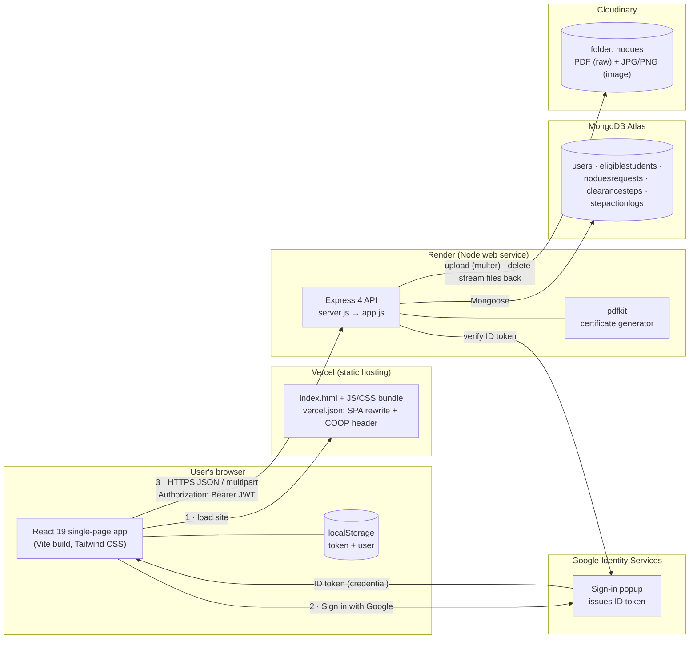
```mermaid
flowchart LR
    subgraph Client["User's browser"]
        SPA["React 19 single-page app<br/>(Vite build, Tailwind CSS)"]
        LS[("localStorage<br/>token + user")]
        SPA --- LS
    end

    subgraph Vercel["Vercel (static hosting)"]
        STATIC["index.html + JS/CSS bundle<br/>vercel.json: SPA rewrite + COOP header"]
    end

    subgraph Render["Render (Node web service)"]
        API["Express 4 API<br/>server.js → app.js"]
        PDF["pdfkit<br/>certificate generator"]
        API --- PDF
    end

    subgraph Google["Google Identity Services"]
        GIS["Sign-in popup<br/>issues ID token"]
    end

    subgraph Atlas["MongoDB Atlas"]
        DB[("users · eligiblestudents ·<br/>noduesrequests · clearancesteps ·<br/>stepactionlogs")]
    end

    subgraph Cloud["Cloudinary"]
        FILES[("folder: nodues<br/>PDF (raw) + JPG/PNG (image)")]
    end

    SPA -- "1 · load site" --> STATIC
    SPA -- "2 · Sign in with Google" --> GIS
    GIS -- "ID token (credential)" --> SPA
    SPA -- "3 · HTTPS JSON / multipart<br/>Authorization: Bearer JWT" --> API
    API -- "verify ID token" --> GIS
    API -- "Mongoose" --> DB
    API -- "upload (multer) · delete ·<br/>stream files back" --> FILES
```

> **What it shows:** the five pieces that make up the live portal and how they talk to each other: the React site (served by Vercel) running in the user's browser, the Express API (on Render), Google sign-in, the MongoDB Atlas database and Cloudinary file storage.
>
> **Why it matters:** it shows where each responsibility lives. The browser only ever talks to Vercel (to load the site), Google (to sign in) and our API. Only the API can reach the database and the stored files, so every rule and permission check happens in one place that users cannot tamper with.
>
> **How to read it:** follow the numbered arrows. (1) The browser downloads the site from Vercel. (2) The user signs in through Google's popup and receives an ID token. (3) Every later action is an HTTPS call to the API carrying our own JWT; the API verifies the Google token, reads/writes MongoDB and uploads/streams files from Cloudinary.

**Key points**

- The browser never talks to MongoDB or Cloudinary directly. Documents are **streamed through the
  backend** after a permission check, so raw Cloudinary URLs are never sent to the page.
- Google only proves who the person is. **What they may do** comes from our own database
  (`User.permissionCodes` and the `EligibleStudent` list), and it is re-checked on **every** API call.
- Pushing to `master` redeploys both halves automatically (see [Deployment](#18-deployment)).

---

## 4. Backend architecture

### 4.1 Request pipeline

Every HTTP request goes through the same layers, in this order:

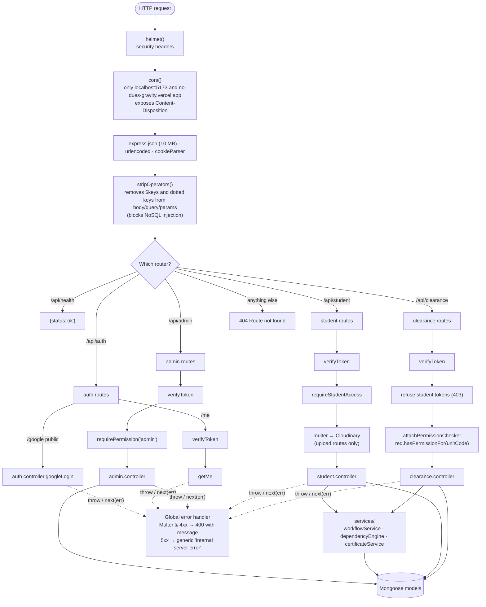
```mermaid
flowchart TD
    REQ(["HTTP request"]) --> H["helmet()<br/>security headers"]
    H --> C["cors()<br/>only localhost:5173 and no-dues-gravity.vercel.app<br/>exposes Content-Disposition"]
    C --> P["express.json (10 MB) · urlencoded · cookieParser"]
    P --> S["stripOperators()<br/>removes $keys and dotted keys from body/query/params<br/>(blocks NoSQL injection)"]
    S --> R{"Which router?"}

    R -->|/api/health| HEALTH["{status:'ok'}"]
    R -->|/api/auth| AUTH["auth routes"]
    R -->|/api/admin| ADM["admin routes"]
    R -->|/api/student| STU["student routes"]
    R -->|/api/clearance| CLR["clearance routes"]
    R -->|anything else| NF["404 Route not found"]

    AUTH -->|/google public| AC["auth.controller.googleLogin"]
    AUTH -->|/me| VT1["verifyToken"] --> AC2["getMe"]

    ADM --> VT2["verifyToken"] --> RP["requirePermission('admin')"] --> ADC["admin.controller"]

    STU --> VT3["verifyToken"] --> RSA["requireStudentAccess"] --> MUL["multer → Cloudinary<br/>(upload routes only)"] --> SC["student.controller"]

    CLR --> VT4["verifyToken"] --> NS["refuse student tokens (403)"] --> APC["attachPermissionChecker<br/>req.hasPermissionFor(unitCode)"] --> CC["clearance.controller"]

    SC --> SVC["services/<br/>workflowService · dependencyEngine · certificateService"]
    CC --> SVC
    ADC --> M[("Mongoose models")]
    SVC --> M
    SC --> M
    CC --> M

    AC & AC2 & ADC & SC & CC -.->|"throw / next(err)"| EH["Global error handler<br/>Multer & 4xx → 400 with message<br/>5xx → generic 'Internal server error'"]
```

> **What it shows:** the exact path one HTTP request takes inside the backend, from arrival to the controller that answers it, including every security layer on the way.
>
> **Why it matters:** the order of middleware is what makes the API safe. Security headers and CORS run first, malicious `$` operators are stripped before any code can use the input, and each router adds its own checks (token → permission) before the business logic runs. Any error from any layer ends in the same error handler, so internal details are never leaked.
>
> **How to read it:** read top to bottom. After `stripOperators` the request branches by URL prefix into one of four routers. Each router lane shows its guards in order, e.g. `/api/admin` = verifyToken → requirePermission('admin') → admin.controller. Dotted arrows lead to the global error handler.

### 4.2 Layers

| Layer | Folder | Responsibility |
|---|---|---|
| Entry | `server.js` | Load `.env`, connect MongoDB, then `app.listen(PORT)` |
| App | `app.js` | Middleware order, routers, 404, error handler (no `listen`, so tests can import it) |
| Config | `config/` | DB connection, Cloudinary SDK, upload rules, **permission codes**, **workflow rules** |
| Middleware | `middleware/` | `verifyToken` (JWT plus a DB re-check), `requirePermission`, `attachPermissionChecker`, `requireRole` |
| Routes | `routes/` | URL → controller mapping and which middleware runs |
| Controllers | `controllers/` | Request validation, authorization per step, responses |
| Services | `services/` | Business engine: create steps, unlock/relock, request status, certificate PDF |
| Models | `models/` | Mongoose schemas and indexes |
| Utils | `utils/` | Google ID-token verification, JWT sign/verify |

### 4.3 Services

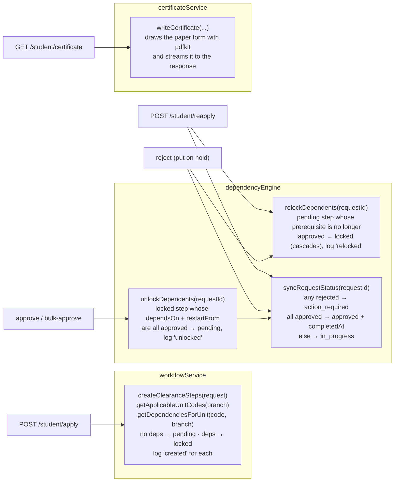
```mermaid
flowchart LR
    subgraph workflowService
        CCS["createClearanceSteps(request)<br/>getApplicableUnitCodes(branch)<br/>getDependenciesForUnit(code, branch)<br/>no deps → pending · deps → locked<br/>log 'created' for each"]
    end
    subgraph dependencyEngine
        UD["unlockDependents(requestId)<br/>locked step whose dependsOn + restartFrom<br/>are all approved → pending, log 'unlocked'"]
        RD["relockDependents(requestId)<br/>pending step whose prerequisite is no longer<br/>approved → locked (cascades), log 'relocked'"]
        SRS["syncRequestStatus(requestId)<br/>any rejected → action_required<br/>all approved → approved + completedAt<br/>else → in_progress"]
        UD --> SRS
    end
    subgraph certificateService
        WC["writeCertificate(...)<br/>draws the paper form with pdfkit<br/>and streams it to the response"]
    end

    APPLY["POST /student/apply"] --> CCS
    APPROVE["approve / bulk-approve"] --> UD
    HOLD["reject (put on hold)"] --> SRS
    HOLD --> RD
    REAPPLY["POST /student/reapply"] --> RD
    REAPPLY --> SRS
    CERT["GET /student/certificate"] --> WC
```

> **What it shows:** the three service modules that hold the core business logic and which API actions call them.
>
> **Why it matters:** controllers stay thin; the rules for creating steps, unlocking/re-locking them and computing the application's overall status live in one place (`dependencyEngine`) and are reused by approve, bulk approve, put on hold and reapply. This is what keeps every path consistent.
>
> **How to read it:** the boxes on the left are API actions; arrows point to the service function each one calls. `unlockDependents` always finishes by calling `syncRequestStatus`, which is how an application becomes Completed automatically after the last approval.

---

## 5. Frontend architecture

### 5.1 Component tree

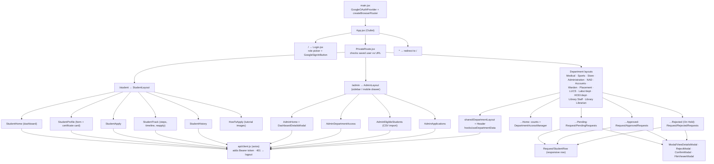
```mermaid
flowchart TD
    MAIN["main.jsx<br/>GoogleOAuthProvider + createBrowserRouter"] --> APP["App.jsx (Outlet)"]
    APP --> LOGIN["/ → Login.jsx<br/>role picker + GoogleSignInButton"]
    APP --> PR["PrivateRoute.jsx<br/>checks saved user vs URL"]
    APP --> CATCH["* → redirect to /"]

    PR --> SL["/student → StudentLayout"]
    SL --> SH["StudentHome (dashboard)"]
    SL --> SP["StudentProfile (form + certificate card)"]
    SL --> SA["StudentApply"]
    SL --> ST["StudentTrack (steps, timeline, reapply)"]
    SL --> SHI["StudentHistory"]
    SL --> HTA["HowToApply (tutorial images)"]

    PR --> AL["/admin → AdminLayout (sidebar / mobile drawer)"]
    AL --> AH["AdminHome + DashboardDetailsModal"]
    AL --> ADA["AdminDepartmentAccess"]
    AL --> AES["AdminEligibleStudents (CSV import)"]
    AL --> AAP["AdminApplications"]

    PR --> DL["Department layouts<br/>Medical · Sports · Store · Administration · NAD · Accounts ·<br/>Warden · Placement · LUCS · Labs/:dept · HOD/:dept ·<br/>Library Staff · Library Librarian"]
    DL --> SHARED["shared/DepartmentLayout + Header<br/>hooks/useDepartmentData"]
    DL --> DH["…Home: counts + DepartmentAccessManager"]
    DL --> DP["…Pending: Request/PendingRequests"]
    DL --> DA["…Approved: Request/ApprovedRequests"]
    DL --> DR["…Rejected (On Hold): Request/RejectedRequests"]
    DP & DA & DR --> ROW["Request/StudentRow (responsive row)"]
    DP & DA & DR --> MOD["Modal/ViewDetailsModal · RejectModal ·<br/>ConfirmModal · FileViewerModal"]

    SH & SP & SA & ST & SHI & AH & ADA & AES & AAP & SHARED --> API["api/client.js (axios)<br/>adds Bearer token · 401 → logout"]
```

> **What it shows:** the structure of the React app: the router in `main.jsx`, the `PrivateRoute` guard, the three families of pages (student portal, admin panel, department dashboards) and the shared pieces they reuse.
>
> **Why it matters:** all 13 department dashboards are built from the same shared layout, hook, lists and modals, so a fix in one shared component fixes every department. Everything talks to the backend through one API client that attaches the token and handles expired sessions.
>
> **How to read it:** start at `main.jsx`. `/` is the login page; everything else sits under `PrivateRoute`. Follow a branch down to see which pages a section has; the bottom node (`api/client.js`) is used by all of them.

### 5.2 How a department page gets its data

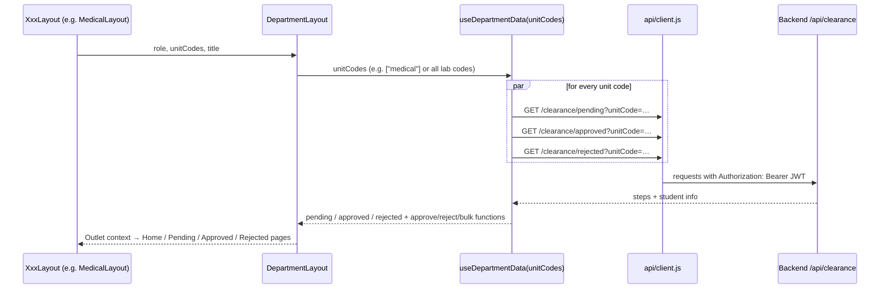
```mermaid
sequenceDiagram
    participant L as XxxLayout (e.g. MedicalLayout)
    participant D as DepartmentLayout
    participant H as useDepartmentData(unitCodes)
    participant A as api/client.js
    participant B as Backend /api/clearance

    L->>D: role, unitCodes, title
    D->>H: unitCodes (e.g. ["medical"] or all lab codes)
    par for every unit code
        H->>A: GET /clearance/pending?unitCode=…
        H->>A: GET /clearance/approved?unitCode=…
        H->>A: GET /clearance/rejected?unitCode=…
    end
    A->>B: requests with Authorization: Bearer JWT
    B-->>H: steps + student info
    H-->>D: pending / approved / rejected + approve/reject/bulk functions
    D-->>L: Outlet context → Home / Pending / Approved / Rejected pages
```

> **What it shows:** how a department dashboard loads its lists when it opens.
>
> **Why it matters:** it explains why every department behaves identically: the layout passes its unit codes (one code for Medical, many for a lab group) to `useDepartmentData`, which fetches Pending, Approved and On Hold for each code in parallel and hands the results plus approve/hold functions to every tab.
>
> **How to read it:** time flows downward. The `par` block means the requests run at the same time. The final arrow shows the data reaching the Home / Pending / Approved / Rejected pages through the Outlet context.

### 5.3 Frontend conventions

- **Routing guard:** `PrivateRoute` is a UI convenience only. Students may open only `/student/*`,
  admins may open everything, and staff may open only the sections in their permission codes. The
  backend enforces the same rules on every call.
- **Session:** the JWT and user are kept in `localStorage`. On any `401` the client clears them,
  saves the reason in `sessionStorage.loginNotice`, and the login page shows it.
- **Google button:** `GoogleSignInButton` initialises Google Identity Services **once** per client
  ID. Re-initialising causes a console warning.
- **Responsive:** `StudentRow` is shared by every list. Headers collapse to one row at the `xl`
  breakpoint, the admin sidebar becomes a slide-in drawer on phones, and `no-scrollbar` is a
  Tailwind utility defined in `index.css`.
- **Configuration shared with the backend:** `config/branches.js` must match
  `BACKEND/config/workflowConfig.js`, and `config/applicationNo.js` builds the `ND-YYYY-ROLL` format.

---

## 6. Database design (ER diagram)

MongoDB (Atlas) with five collections. Relations are either **ObjectId references**
(`requestId`, `stepId`, `addedBy`) or **email links**. Email links join `User`, `EligibleStudent`
and `NoDuesRequest` for the same student, and they record which staff member acted on a step.


```mermaid
erDiagram
    USER {
        ObjectId _id PK
        String name
        String email UK "lowercase"
        StringArray permissionCodes "student, medical, hod_cse, labs_mech, admin ..."
        Date createdAt
        Date updatedAt
    }

    ELIGIBLE_STUDENT {
        ObjectId _id PK
        String name
        String email UK "lowercase"
        String rollNo UK "e.g. 23UEC513"
        String branch "CSE ECE CCE MECH"
        String graduation "UG or PG from rollNo"
        ObjectId addedBy FK "User (admin)"
        Boolean profileCompleted
        Date submittedAt
        String phone
        String hostel "BH1-BH5 GH"
        String clubRoleType "None, Club Coordinator, Fest OC, Both"
        String clubRoleDetail
        String festRoleDetail
        String placementStatus "Placed, Unplaced, Higher Studies..."
        String placementDetailsText
        String libraryEmailDate
        String tpcEmailDate
        String accountHolderName
        String bankAccountNumber
        String bankName
        String bankBranch
        String bankCity
        String ifscCode
        String donationAmount
        String studentContactNumber
        String fatherName
        String fatherMobileNumber
        String correspondenceAddress
        Boolean declarationAccepted
        String idCardFileUrl "Cloudinary"
        String btpReportFileUrl "Cloudinary"
        String offerLetterFileUrl "Cloudinary"
        String placementDeclarationFileUrl "Cloudinary"
        String admissionLetterFileUrl "Cloudinary"
        String examScorecardFileUrl "Cloudinary"
        String cancelledChequeFileUrl "Cloudinary"
    }

    NO_DUES_REQUEST {
        ObjectId _id PK
        String applicationNo "ND-2026-23UEC513"
        String studentEmail "links to student"
        String studentName
        String rollNo
        String branch
        String phone "snapshot"
        String hostel "snapshot"
        String idCardUrl "snapshot"
        String btpReportEmailDate
        String btpReportUrl
        String placementStatus
        String offerLetterUrl
        String declarationUrl
        String admissionLetterUrl
        String examScorecardUrl
        String rfidStatus "verified or pending"
        String status "submitted, in_progress, action_required, approved"
        Date submittedAt
        Date completedAt
        String reapplyData_comment "embedded reapplyData"
        String reapplyData_proofUrl
        Date reapplyData_submittedAt
    }

    CLEARANCE_STEP {
        ObjectId _id PK
        ObjectId requestId FK "NoDuesRequest"
        String unitCode "medical, cse_lab_1, hod_ece ..."
        String unitLabel "Medical Officer ..."
        String unitGroup "labs_cse_cce or null"
        String status "locked, pending, approved, rejected"
        StringArray dependsOn "fixed at apply time"
        StringArray restartFrom "departments to reset on reapply"
        String actionBy "staff email"
        Date actionAt
        String rejectionReason
        String rejectionDescription
        Date rejectedAt
        String studentReply
        StringArray studentProofUrls
        Date repliedAt
    }

    STEP_ACTION_LOG {
        ObjectId _id PK
        ObjectId stepId FK "ClearanceStep"
        ObjectId requestId FK "NoDuesRequest"
        String action "created, unlocked, approved, rejected, student_replied, reapply, reopened, relocked"
        String actorEmail "system or email"
        String actorRole "system, staff, admin, student"
        String note
        StringArray proofUrls
        Date timestamp
    }

    USER ||--o{ ELIGIBLE_STUDENT : "adds (addedBy)"
    ELIGIBLE_STUDENT ||--o| USER : "same email = student login"
    ELIGIBLE_STUDENT ||--o{ NO_DUES_REQUEST : "email = studentEmail"
    NO_DUES_REQUEST ||--|{ CLEARANCE_STEP : "has 39-40 steps"
    NO_DUES_REQUEST ||--o{ STEP_ACTION_LOG : "timeline"
    CLEARANCE_STEP ||--o{ STEP_ACTION_LOG : "events"
    USER ||--o{ CLEARANCE_STEP : "acts on (actionBy = email)"
    CLEARANCE_STEP }o--o{ CLEARANCE_STEP : "dependsOn / restartFrom (by unitCode)"
```

> **What it shows:** the database: five collections, every field they store, the keys (PK = primary key, FK = reference to another collection, UK = unique) and how records relate.
>
> **Why it matters:** it is the data model the whole workflow is built on. One eligible student can have several applications over time; each application has 39–40 clearance steps (one per department); every change to a step is recorded as a timeline log entry. Users (staff/admin) are linked to the steps they approved through their email.
>
> **How to read it:** each box is a collection. The line endings are crow's-foot notation: `||` means exactly one, `o|` zero or one, `o{` zero or many, `|{` one or many. For example `NO_DUES_REQUEST ||--|{ CLEARANCE_STEP` reads "one application has one or more steps". The self-link on CLEARANCE_STEP is the prerequisite relation (`dependsOn` / `restartFrom`), stored as unit codes.

### 6.1 Collections in detail

| Collection | One document = | Written by | Indexes |
|---|---|---|---|
| `users` | a person who can sign in (student, staff or admin) | login (student auto-created), admin, department access managers | `email` unique |
| `eligiblestudents` | a student allowed to apply, **plus their whole profile** and document URLs | admin (identity), student (profile) | `email` unique, `rollNo` unique |
| `noduesrequests` | one application (snapshot of the student at apply time plus overall status) | apply, dependency engine, reapply | `{studentEmail, status}` |
| `clearancesteps` | one department's part of one application | apply (created), staff (approve/hold), engine (unlock/relock), reapply | `{unitCode, status}`, `{requestId}` |
| `stepactionlogs` | one event on a step; append-only timeline | every action | `{stepId, timestamp}`, `{requestId}` |

**Design choices**

- **The profile lives in `EligibleStudent`, not `User`.** `User` holds only authentication and
  permissions, so a staff member who is also a student does not mix the two.
- **The request keeps a snapshot** of key profile fields at apply time. The live profile is still
  read for "View details" and for the certificate's bank section.
- **Steps are created up front.** Every step exists from the moment of applying, so progress
  ("27 / 39 approved") and "where is it waiting" are simple queries.
- **The timeline is append-only.** Logs are never updated, only inserted, which keeps the full audit trail.
- **"On Hold" is stored as `rejected`.** The UI always says *On Hold*; the database keeps the
  original enum value.

### 6.2 Example documents

```jsonc
// clearancesteps
{
  "_id": "…", "requestId": "…",
  "unitCode": "hod_ece", "unitLabel": "HOD - ECE", "unitGroup": null,
  "status": "locked",
  "dependsOn": ["cse_lab_1", "…all 28 labs…", "lucs", "library_librarian"],
  "restartFrom": [], "actionBy": "", "rejectionReason": ""
}

// stepactionlogs
{ "stepId": "…", "requestId": "…", "action": "rejected",
  "actorEmail": "medical.officer@lnmiit.ac.in", "actorRole": "staff",
  "note": "[Medicine not returned] Please return the inhaler issued in March", "proofUrls": [] }
```

---

## 7. Departments, unit codes and permissions

`BACKEND/config/permissionCodes.js` is the single source of truth.

### 7.1 Approval units (one clearance step each)

| Unit code | Label | Applies to |
|---|---|---|
| `medical` | Medical Officer | all |
| `sports` | Sports Officer | all |
| `lucs` | LUCS | all |
| `warden` | Warden In Charge | all |
| `placement` | Placement Office | all |
| `administration` | Administration | all |
| `library_staff` | Central Library – Staff | all |
| `library_librarian` | Central Library – Librarian | all |
| `store` | Store | all |
| `nad` | NAD Cell | all |
| `accounts` | Accounts | all |
| `hod_cse` / `hod_ece` / `hod_cce` / `hod_mech` | HOD – branch | **only the student's own branch** |
| `cse_lab_1`, `cse_lab_2`, `cse_lab_3`, `cse_lab_cmlbda` | CSE labs (4) | all |
| `ece_lab_microwave`, `ece_lab_adc`, `ece_lab_ti`, `ece_lab_dsp`, `ece_lab_ecad`, `ece_lab_be` | ECE labs (6) | all |
| `ece_lab_kundan` | Final Approval ECE (Mr. Kundan Shahi) | **ECE students only** |
| `mech_lab_*` (15: workshop, mechatronics, robotics, cim, cad, kd, material, measurement, fmm, ic_engine, thermodynamics, heat_transfer, eng_graphics, automotive, cria) | MECH labs | all |
| `physics_lab_ug`, `physics_lab_optics` | Physics labs (2) | all |

**Steps per student:** 11 universal + 27 labs + 1 HOD = **39**. ECE students also get
`ece_lab_kundan`, so they have **40**.

### 7.2 Permission codes → dashboards

| Permission code | Dashboard route | Acts on |
|---|---|---|
| `medical`, `sports`, `lucs`, `warden`, `placement`, `administration`, `store`, `nad`, `accounts` | `/medical`, `/sports`, … | that unit |
| `library_staff` / `library_librarian` | `/library/staff` / `/library/librarian` | that unit |
| `hod_cse`, `hod_ece`, `hod_cce`, `hod_mech` | `/hod/cse`, `/hod/ece`, … | that HOD unit |
| `labs_cse_cce` (group) | `/labs/cse-cce` | the 4 CSE labs |
| `labs_ece_cce` (group) | `/labs/ece-cce` | the 7 ECE labs |
| `labs_mech` (group) | `/labs/mech` | the 15 MECH labs |
| `labs_physics` (group) | `/labs/physics` | the 2 Physics labs |
| `admin` | `/admin` (and every dashboard) | everything |
| `student` | `/student` | nothing on `/api/clearance` |

`resolvePermittedUnitCodes()` expands group codes into their unit codes. `req.hasPermissionFor(unitCode)`
is checked on every list, action, detail and file request.

### 7.3 What each department may see ("View details")

Everyone sees the common identity fields (name, roll no., email, branch, UG/PG, phone) and the
**ID card**. Extra fields and documents are sent only to the departments below, and the backend
filters them (`DEPT_PROFILE_ACCESS` in `clearance.controller.js`):

| Department | Extra fields | Extra documents |
|---|---|---|
| Placement | placement status, TPC email date, placement details | offer letter, placement declaration, admission letter, exam scorecard |
| Library Staff / Librarian | library email date | BTP report |
| Accounts | all bank / refund details, donation, contact, father's name & mobile, address, declaration | cancelled cheque |
| Store | club/fest role type and details | — |
| Warden | hostel | — |
| Everyone else | — | — |

---

## 8. The clearance workflow (dependency graph)

Rules come from `BACKEND/config/workflowConfig.js`. An arrow **A → B** means *B unlocks only
after A is approved*. Everything without incoming arrows starts as **Pending** the moment the
student applies.

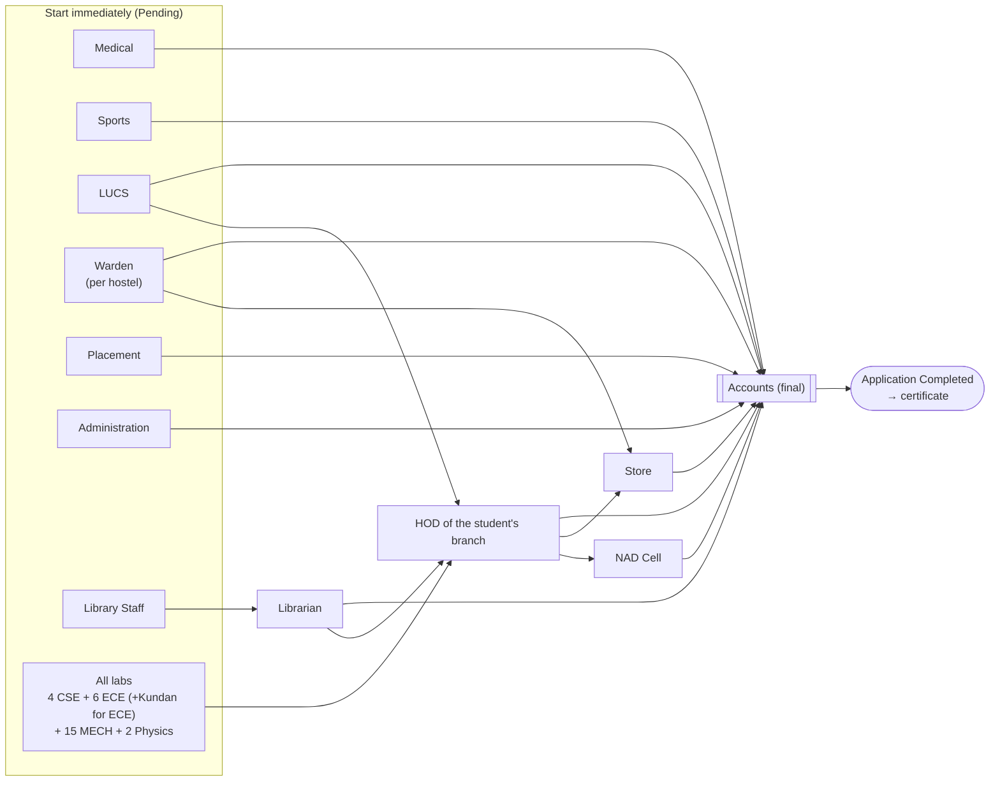
```mermaid
flowchart LR
    subgraph Independent["Start immediately (Pending)"]
        MED[Medical]
        SPO[Sports]
        LUCS[LUCS]
        WAR["Warden<br/>(per hostel)"]
        PLA[Placement]
        ADMN[Administration]
        LS[Library Staff]
        LABS["All labs<br/>4 CSE + 6 ECE (+Kundan for ECE)<br/>+ 15 MECH + 2 Physics"]
    end

    LS --> LIB[Librarian]
    LABS --> HOD["HOD of the student's branch"]
    LUCS --> HOD
    LIB --> HOD
    HOD --> NAD[NAD Cell]
    HOD --> STO[Store]
    WAR --> STO

    MED --> ACC[["Accounts (final)"]]
    SPO --> ACC
    LUCS --> ACC
    WAR --> ACC
    PLA --> ACC
    LIB --> ACC
    ADMN --> ACC
    HOD --> ACC
    NAD --> ACC
    STO --> ACC

    ACC --> DONE(["Application Completed<br/>→ certificate"])
```

> **What it shows:** which departments must approve before another department can act.
>
> **Why it matters:** this is the heart of the No Dues process and mirrors the paper form: the HOD signs only after the labs, LUCS and the library; NAD and Store come after the HOD; Accounts signs last. The portal enforces it automatically instead of relying on the student to visit offices in order.
>
> **How to read it:** departments inside the "Start immediately" box are Pending the moment the student applies. An arrow A → B means B stays Locked until A approves; a box with several incoming arrows waits for all of them. When Accounts approves, the application is complete.

| Step | Waits for (`dependsOn`) |
|---|---|
| Librarian | Library Staff |
| HOD (own branch) | every lab the student has + LUCS + Librarian |
| NAD Cell | HOD |
| Store | HOD + Warden |
| Accounts | Medical, Sports, LUCS, Warden, Placement, Librarian, Administration, HOD, NAD, Store |
| everything else | nothing |

`dependsOn` is fixed when the application is created. The HOD's list is filtered to the labs this
student actually has, so a non-ECE student's HOD never waits for the Kundan lab.

---

## 9. State machines

### 9.1 A clearance step

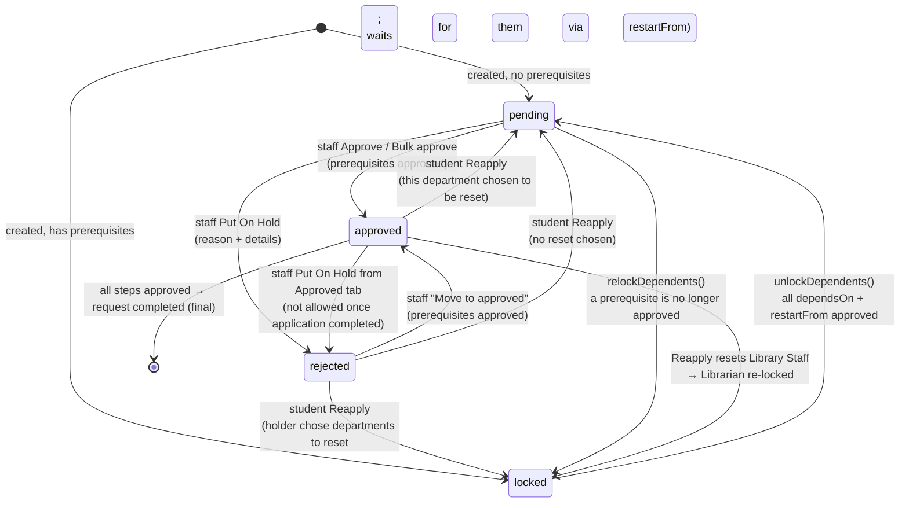
```mermaid
stateDiagram-v2
    [*] --> pending: created, no prerequisites
    [*] --> locked: created, has prerequisites

    locked --> pending: unlockDependents()<br/>all dependsOn + restartFrom approved
    pending --> approved: staff Approve / Bulk approve<br/>(prerequisites approved)
    pending --> rejected: staff Put On Hold<br/>(reason + details)
    approved --> rejected: staff Put On Hold from Approved tab<br/>(not allowed once application completed)
    rejected --> approved: staff "Move to approved"<br/>(prerequisites approved)

    rejected --> pending: student Reapply<br/>(no reset chosen)
    rejected --> locked: student Reapply<br/>(holder chose departments to reset;<br/>waits for them via restartFrom)
    approved --> pending: student Reapply<br/>(this department chosen to be reset)
    pending --> locked: relockDependents()<br/>a prerequisite is no longer approved
    approved --> locked: Reapply resets Library Staff<br/>→ Librarian re-locked

    approved --> [*]: all steps approved → request completed (final)
```

> **What it shows:** every status a single department step can be in and every event that moves it between statuses.
>
> **Why it matters:** it defines what staff are allowed to do and what the system does automatically. For example, a Locked step can never be approved directly, an On Hold step can be moved straight to Approved, and an Approved step can be put on hold again, but only until the whole application is complete.
>
> **How to read it:** circles are states and arrows are transitions labelled with who or what causes them (staff action, student reapply, or the dependency engine). `[*]` at the top is creation on apply; `[*]` at the bottom is the application being completed, after which nothing changes.

In the UI, `rejected` is always shown as **On Hold**.

### 9.2 An application (`NoDuesRequest.status`)

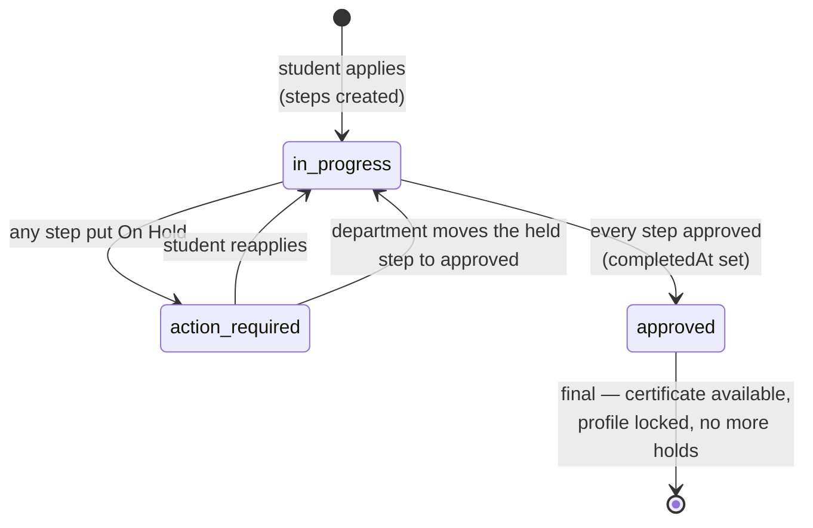
```mermaid
stateDiagram-v2
    [*] --> in_progress: student applies<br/>(steps created)
    in_progress --> action_required: any step put On Hold
    action_required --> in_progress: student reapplies
    action_required --> in_progress: department moves the held step to approved
    in_progress --> approved: every step approved<br/>(completedAt set)
    approved --> [*]: final — certificate available,<br/>profile locked, no more holds
```

> **What it shows:** the overall status of an application as the student and the admin see it.
>
> **Why it matters:** the application status is never set by hand. It is recomputed from its steps after every action: any step On Hold means *action required*, all steps approved means *completed*, otherwise *in progress*. That keeps the dashboard numbers always correct.
>
> **How to read it:** start at `[*]` (apply). It moves back and forth between in progress and action required as holds are raised and resolved, and ends at approved (completed), which is final.

`submitted` exists in the schema as the default, but `applyForNoDues` creates requests directly
as `in_progress`. `syncRequestStatus()` recomputes the status after every action.

---

## 10. Flows

### 10.1 Admin setup

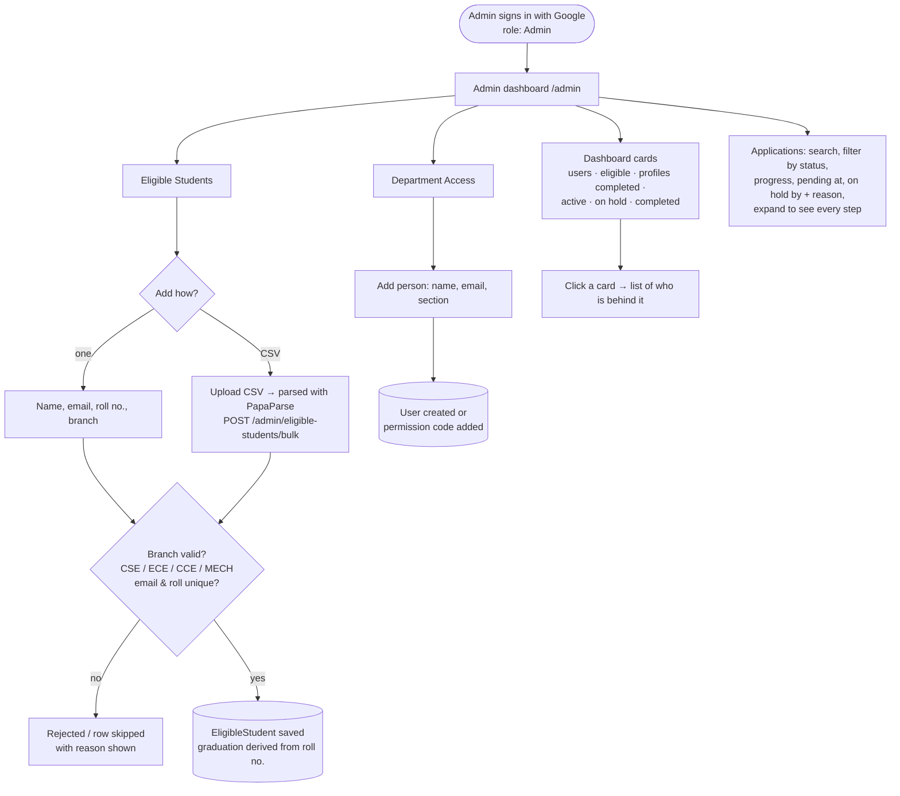
```mermaid
flowchart TD
    A([Admin signs in with Google<br/>role: Admin]) --> D[Admin dashboard /admin]
    D --> E1[Eligible Students]
    E1 --> E2{Add how?}
    E2 -->|one| E3[Name, email, roll no., branch]
    E2 -->|CSV| E4[Upload CSV → parsed with PapaParse<br/>POST /admin/eligible-students/bulk]
    E3 & E4 --> E5{Branch valid?<br/>CSE / ECE / CCE / MECH<br/>email & roll unique?}
    E5 -->|no| E6[Rejected / row skipped<br/>with reason shown]
    E5 -->|yes| E7[(EligibleStudent saved<br/>graduation derived from roll no.)]

    D --> S1[Department Access]
    S1 --> S2[Add person: name, email, section]
    S2 --> S3[(User created or<br/>permission code added)]

    D --> M1[Dashboard cards<br/>users · eligible · profiles completed ·<br/>active · on hold · completed]
    M1 --> M2[Click a card → list of who is behind it]
    D --> AP[Applications: search, filter by status,<br/>progress, pending at, on hold by + reason,<br/>expand to see every step]
```

> **What it shows:** everything the admin does to prepare and monitor the system.
>
> **Why it matters:** nobody can use the portal until the admin has loaded eligible students and given staff access; this diagram is the setup checklist. It also shows the validation on student data (valid branch, unique email and roll number) that prevents broken applications later.
>
> **How to read it:** three branches leave the dashboard: Eligible Students (single add or CSV import, then validation), Department Access (creates the User or adds a permission code) and monitoring (cards and the Applications page).

### 10.2 Sign-in (all roles)

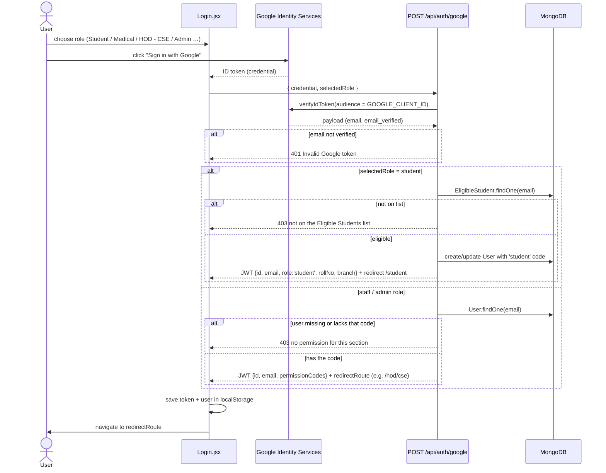
```mermaid
sequenceDiagram
    actor U as User
    participant FE as Login.jsx
    participant G as Google Identity Services
    participant BE as POST /api/auth/google
    participant DB as MongoDB

    U->>FE: choose role (Student / Medical / HOD - CSE / Admin …)
    U->>G: click "Sign in with Google"
    G-->>FE: ID token (credential)
    FE->>BE: { credential, selectedRole }
    BE->>G: verifyIdToken(audience = GOOGLE_CLIENT_ID)
    G-->>BE: payload (email, email_verified)
    alt email not verified
        BE-->>FE: 401 Invalid Google token
    end
    alt selectedRole = student
        BE->>DB: EligibleStudent.findOne(email)
        alt not on list
            BE-->>FE: 403 not on the Eligible Students list
        else eligible
            BE->>DB: create/update User with 'student' code
            BE-->>FE: JWT {id, email, role:'student', rollNo, branch} + redirect /student
        end
    else staff / admin role
        BE->>DB: User.findOne(email)
        alt user missing or lacks that code
            BE-->>FE: 403 no permission for this section
        else has the code
            BE-->>FE: JWT {id, email, permissionCodes} + redirectRoute (e.g. /hod/cse)
        end
    end
    FE->>FE: save token + user in localStorage
    FE->>U: navigate to redirectRoute
```

> **What it shows:** the complete sign-in conversation between the user, the login page, Google, our backend and the database.
>
> **Why it matters:** Google only proves *who* the person is; *what they may open* comes from our database. It shows why a student who is not on the eligible list, or a staff member who picks a section they don't have, is refused even with a valid Google account.
>
> **How to read it:** time runs downward. `alt` boxes are the alternative outcomes: the student branch checks the EligibleStudent list, the staff branch checks the chosen permission code. On success the page stores the JWT and redirects to the right dashboard.

### 10.3 Every protected API call (authorization)

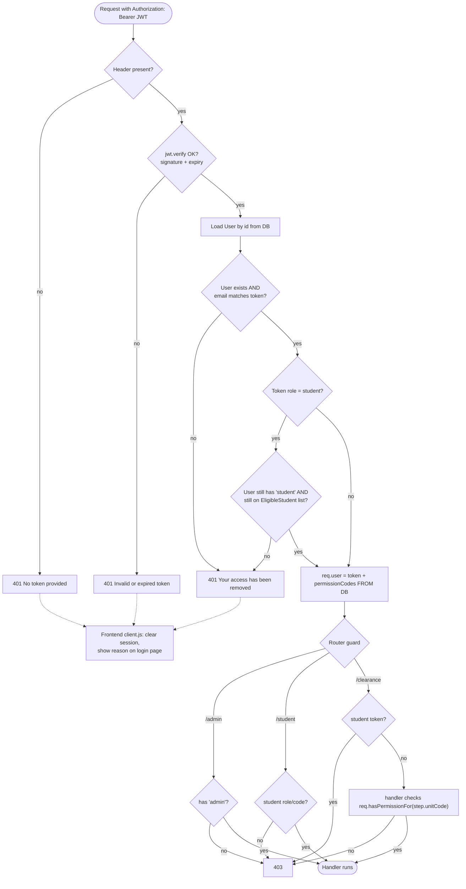
```mermaid
flowchart TD
    R([Request with Authorization: Bearer JWT]) --> A{Header present?}
    A -->|no| X1[401 No token provided]
    A -->|yes| B{jwt.verify OK?<br/>signature + expiry}
    B -->|no| X2[401 Invalid or expired token]
    B -->|yes| C[Load User by id from DB]
    C --> D{User exists AND<br/>email matches token?}
    D -->|no| X3[401 Your access has been removed]
    D -->|yes| E{Token role = student?}
    E -->|yes| F{User still has 'student' AND<br/>still on EligibleStudent list?}
    F -->|no| X3
    F -->|yes| G
    E -->|no| G["req.user = token + permissionCodes FROM DB"]
    G --> H{Router guard}
    H -->|/admin| I{has 'admin'?} -->|no| X4[403]
    H -->|/student| J{student role/code?} -->|no| X4
    H -->|/clearance| K{student token?} -->|yes| X4
    K -->|no| L["handler checks req.hasPermissionFor(step.unitCode)"]
    L -->|no| X4
    L -->|yes| OK([Handler runs])
    I -->|yes| OK
    J -->|yes| OK
    X1 & X2 & X3 -.-> FE["Frontend client.js: clear session,<br/>show reason on login page"]
```

> **What it shows:** the decision tree run on every protected API request.
>
> **Why it matters:** because permissions are re-read from the database each time, removing someone's access or removing a student from the eligible list takes effect immediately instead of when their token expires. It also shows the second layer: each department handler checks the step's unit code.
>
> **How to read it:** follow the diamonds from the top. Any "no" ends in a 401/403 box; the dotted arrow shows the frontend reacting to a 401 by signing the user out and showing the reason. Reaching "Handler runs" means every check passed.

### 10.4 Student lifecycle

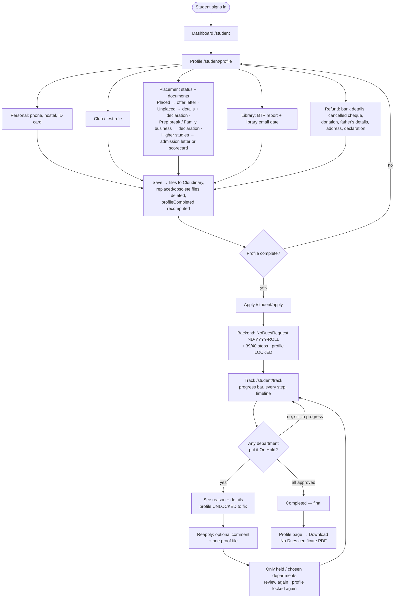
```mermaid
flowchart TD
    S([Student signs in]) --> H[Dashboard /student]
    H --> P[Profile /student/profile]
    P --> P1[Personal: phone, hostel, ID card]
    P --> P2[Club / fest role]
    P --> P3[Placement status + documents<br/>Placed → offer letter · Unplaced → details + declaration ·<br/>Prep break / Family business → declaration ·<br/>Higher studies → admission letter or scorecard]
    P --> P4[Library: BTP report + library email date]
    P --> P5[Refund: bank details, cancelled cheque,<br/>donation, father's details, address, declaration]
    P1 & P2 & P3 & P4 & P5 --> SAVE[Save → files to Cloudinary,<br/>replaced/obsolete files deleted,<br/>profileCompleted recomputed]
    SAVE --> C{Profile complete?}
    C -->|no| P
    C -->|yes| AP[Apply /student/apply]
    AP --> CR[Backend: NoDuesRequest ND-YYYY-ROLL<br/>+ 39/40 steps · profile LOCKED]
    CR --> T[Track /student/track<br/>progress bar, every step, timeline]
    T --> Q{Any department<br/>put it On Hold?}
    Q -->|no, still in progress| T
    Q -->|yes| OH[See reason + details<br/>profile UNLOCKED to fix]
    OH --> RA[Reapply: optional comment<br/>+ one proof file]
    RA --> RS[Only held / chosen departments<br/>review again · profile locked again]
    RS --> T
    Q -->|all approved| DONE[Completed — final]
    DONE --> CERT[Profile page → Download<br/>No Dues certificate PDF]
```

> **What it shows:** the student's whole journey from first sign-in to downloading the certificate.
>
> **Why it matters:** it is the user guide in one picture: which profile sections are needed (and which placement documents depend on the placement status), when the profile locks and unlocks, and how holds and reapplies loop back until everything is approved.
>
> **How to read it:** top to bottom. The profile sections fan out and join at Save; the "Profile complete?" diamond loops back until it is. After Apply the Track page loops while in progress, branches to On Hold → Reapply when a department raises an issue, and ends at Completed → certificate.

### 10.5 Applying (what the backend does)

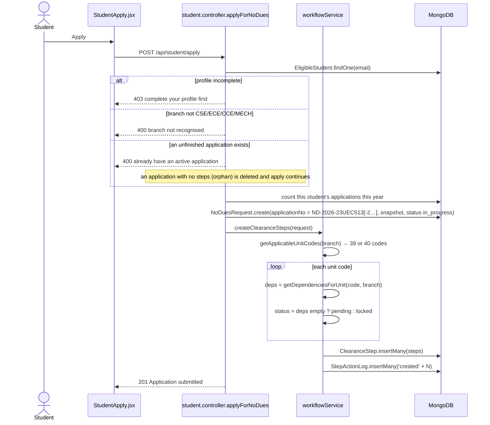
```mermaid
sequenceDiagram
    actor S as Student
    participant FE as StudentApply.jsx
    participant C as student.controller.applyForNoDues
    participant W as workflowService
    participant DB as MongoDB

    S->>FE: Apply
    FE->>C: POST /api/student/apply
    C->>DB: EligibleStudent.findOne(email)
    alt profile incomplete
        C-->>FE: 403 complete your profile first
    else branch not CSE/ECE/CCE/MECH
        C-->>FE: 400 branch not recognised
    else an unfinished application exists
        C-->>FE: 400 already have an active application
        Note over C: an application with no steps (orphan) is deleted and apply continues
    end
    C->>DB: count this student's applications this year
    C->>DB: NoDuesRequest.create(applicationNo = ND-2026-23UEC513[-2…], snapshot, status in_progress)
    C->>W: createClearanceSteps(request)
    W->>W: getApplicableUnitCodes(branch) → 39 or 40 codes
    loop each unit code
        W->>W: deps = getDependenciesForUnit(code, branch)
        W->>W: status = deps empty ? pending : locked
    end
    W->>DB: ClearanceStep.insertMany(steps)
    W->>DB: StepActionLog.insertMany('created' × N)
    C-->>FE: 201 Application submitted
```

> **What it shows:** what the backend does when the student clicks Apply.
>
> **Why it matters:** it shows the checks that guard against bad applications (incomplete profile, unknown branch, a second active application) and how the readable application number and all 39–40 steps are created in one go.
>
> **How to read it:** time runs downward. The `alt` box lists the refusals. The `loop` shows each department step getting its prerequisites and starting as Pending (no prerequisites) or Locked.

### 10.6 Department staff: approve / put on hold

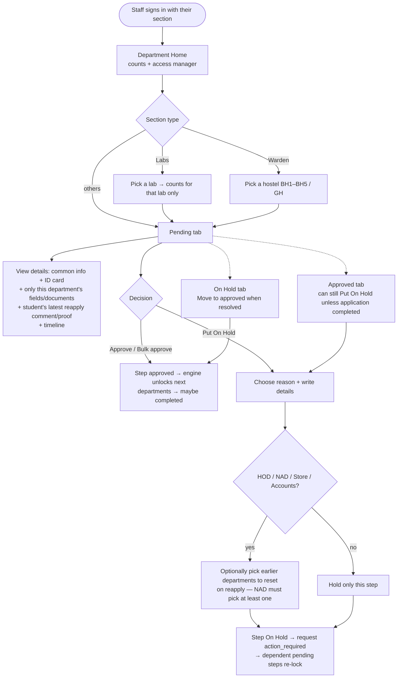
```mermaid
flowchart TD
    L([Staff signs in with their section]) --> DH[Department Home<br/>counts + access manager]
    DH --> SEL{Section type}
    SEL -->|Labs| LAB[Pick a lab → counts for that lab only]
    SEL -->|Warden| HOS[Pick a hostel BH1–BH5 / GH]
    SEL -->|others| PEN
    LAB & HOS --> PEN[Pending tab]
    PEN --> V[View details: common info + ID card<br/>+ only this department's fields/documents<br/>+ student's latest reapply comment/proof<br/>+ timeline]
    PEN --> ACT{Decision}
    ACT -->|Approve / Bulk approve| AP[Step approved → engine unlocks next<br/>departments → maybe completed]
    ACT -->|Put On Hold| HO[Choose reason + write details]
    HO --> HR{HOD / NAD / Store / Accounts?}
    HR -->|yes| HS[Optionally pick earlier departments to reset<br/>on reapply — NAD must pick at least one]
    HR -->|no| HX[Hold only this step]
    HS & HX --> HOLD[Step On Hold → request action_required<br/>→ dependent pending steps re-lock]
    PEN -.-> APR[Approved tab<br/>can still Put On Hold unless application completed]
    PEN -.-> REJ[On Hold tab<br/>Move to approved when resolved]
    APR --> HO
    REJ --> AP
```

> **What it shows:** a department officer's daily routine on their dashboard.
>
> **Why it matters:** it explains the actions available on each tab and the special cases: Labs pick a lab, Warden picks a hostel, and HOD/NAD/Store/Accounts can choose earlier departments to re-check when putting an application on hold.
>
> **How to read it:** start at sign-in, go through the section-type choice to the Pending tab, then follow either the Approve branch or the Put On Hold branch. Dotted arrows show the Approved and On Hold tabs, from which a decision can still be changed.

### 10.7 Approve and the dependency engine

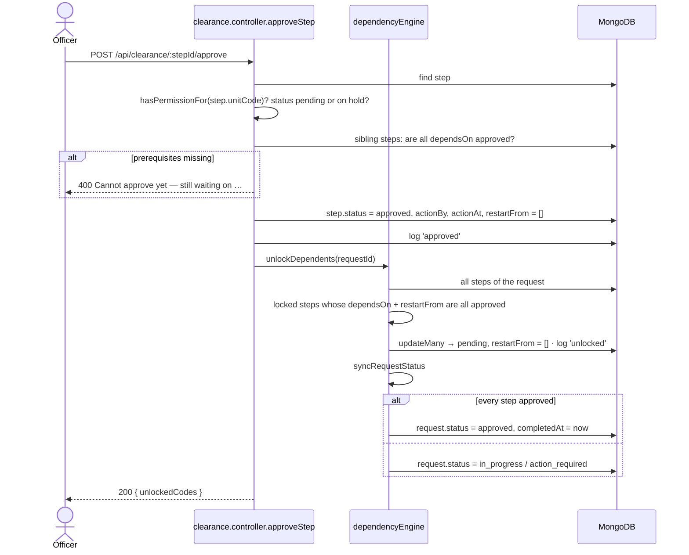
```mermaid
sequenceDiagram
    actor O as Officer
    participant C as clearance.controller.approveStep
    participant E as dependencyEngine
    participant DB as MongoDB

    O->>C: POST /api/clearance/:stepId/approve
    C->>DB: find step
    C->>C: hasPermissionFor(step.unitCode)? status pending or on hold?
    C->>DB: sibling steps: are all dependsOn approved?
    alt prerequisites missing
        C-->>O: 400 Cannot approve yet — still waiting on …
    end
    C->>DB: step.status = approved, actionBy, actionAt, restartFrom = []
    C->>DB: log 'approved'
    C->>E: unlockDependents(requestId)
    E->>DB: all steps of the request
    E->>E: locked steps whose dependsOn + restartFrom are all approved
    E->>DB: updateMany → pending, restartFrom = [] · log 'unlocked'
    E->>E: syncRequestStatus
    alt every step approved
        E->>DB: request.status = approved, completedAt = now
    else
        E->>DB: request.status = in_progress / action_required
    end
    C-->>O: 200 { unlockedCodes }
```

> **What it shows:** what happens inside the server when a step is approved.
>
> **Why it matters:** it shows how approving one step can automatically open the next departments and, after the last approval, mark the whole application Completed, all without anyone doing it manually.
>
> **How to read it:** time runs downward. The first `alt` refuses approval while prerequisites are missing. The dependency engine then finds Locked steps whose prerequisites are now all approved, unlocks them, and recomputes the application status (second `alt`).

### 10.8 Put on hold

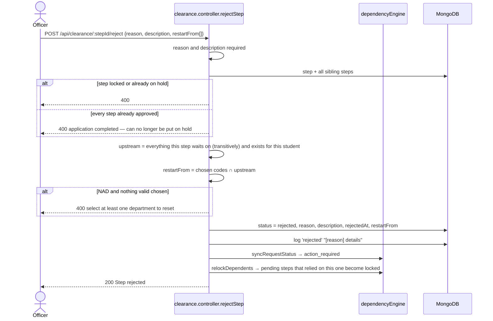
```mermaid
sequenceDiagram
    actor O as Officer
    participant C as clearance.controller.rejectStep
    participant E as dependencyEngine
    participant DB as MongoDB

    O->>C: POST /api/clearance/:stepId/reject {reason, description, restartFrom[]}
    C->>C: reason and description required
    C->>DB: step + all sibling steps
    alt step locked or already on hold
        C-->>O: 400
    else every step already approved
        C-->>O: 400 application completed — can no longer be put on hold
    end
    C->>C: upstream = everything this step waits on (transitively) and exists for this student
    C->>C: restartFrom = chosen codes ∩ upstream
    alt NAD and nothing valid chosen
        C-->>O: 400 select at least one department to reset
    end
    C->>DB: status = rejected, reason, description, rejectedAt, restartFrom
    C->>DB: log 'rejected' "[reason] details"
    C->>E: syncRequestStatus → action_required
    C->>E: relockDependents → pending steps that relied on this one become locked
    C-->>O: 200 Step rejected
```

> **What it shows:** what happens inside the server when a department puts an application on hold.
>
> **Why it matters:** it documents the safety rules: a reason and details are compulsory, a completed application can't be held, NAD must choose a department to reset, and resets are limited to departments that come *before* this one (so the chain can never deadlock).
>
> **How to read it:** time runs downward. After validation the step is saved as On Hold, the timeline records the reason, the application becomes *action required*, and any later step that was already pending because of this one is locked again.

### 10.9 Reapply: who gets reset

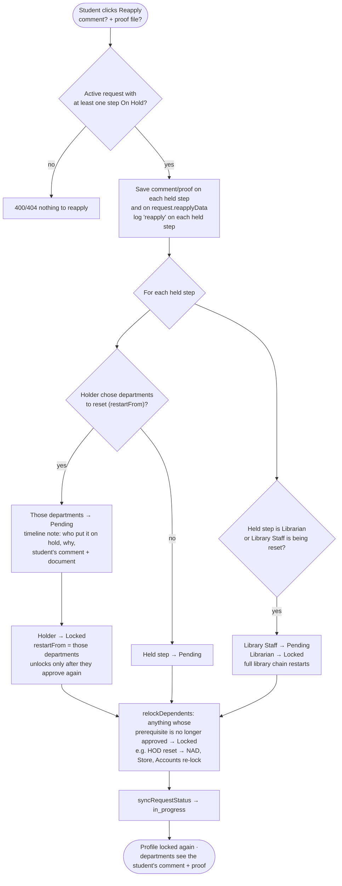
```mermaid
flowchart TD
    R([Student clicks Reapply<br/>comment? + proof file?]) --> F{Active request with<br/>at least one step On Hold?}
    F -->|no| X[400/404 nothing to reapply]
    F -->|yes| SV[Save comment/proof on each held step<br/>and on request.reapplyData<br/>log 'reapply' on each held step]
    SV --> LOOP{For each held step}
    LOOP --> Q{"Holder chose departments<br/>to reset (restartFrom)?"}
    Q -->|yes| A1[Those departments → Pending<br/>timeline note: who put it on hold, why,<br/>student's comment + document]
    A1 --> A2[Holder → Locked<br/>restartFrom = those departments<br/>unlocks only after they approve again]
    Q -->|no| B1[Held step → Pending]
    LOOP --> LIB{Held step is Librarian<br/>or Library Staff is being reset?}
    LIB -->|yes| L1[Library Staff → Pending<br/>Librarian → Locked<br/>full library chain restarts]
    A2 & B1 & L1 --> RL[relockDependents: anything whose<br/>prerequisite is no longer approved → Locked<br/>e.g. HOD reset → NAD, Store, Accounts re-lock]
    RL --> SY[syncRequestStatus → in_progress]
    SY --> OUT([Profile locked again ·<br/>departments see the student's comment + proof])
```

> **What it shows:** exactly which departments are reset when the student reapplies.
>
> **Why it matters:** reapply is the most complex rule in the system. Only the departments concerned review again, a holder that asked others to re-check waits for them, and the library always restarts as a pair. This avoids making the student go through every department a second time.
>
> **How to read it:** for each held step, take the "yes" branch if the holder chose departments to reset (they become Pending, the holder becomes Locked and waits for them) or the "no" branch (the held step simply returns to Pending). The library rule is applied separately. Finally a cascade re-locks later steps and the application returns to *in progress*.

**Example.** The HOD puts the application on hold and chooses *CSE Lab-1* and *Library* to reset. On reapply:
CSE Lab-1 and Library Staff become **Pending**, the Librarian is **Locked** until Library Staff
approves, and the HOD is **Locked** with `restartFrom = [cse_lab_1, library_staff]`. The HOD
therefore unlocks only after CSE Lab-1 **and** the Librarian have approved again.

### 10.10 Documents: upload and view

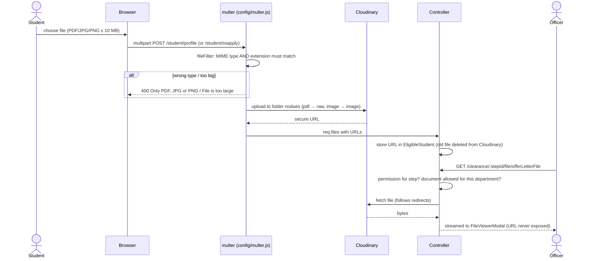
```mermaid
sequenceDiagram
    actor S as Student
    participant FE as Browser
    participant M as multer (config/multer.js)
    participant CL as Cloudinary
    participant BE as Controller
    actor O as Officer

    S->>FE: choose file (PDF/JPG/PNG ≤ 10 MB)
    FE->>M: multipart POST /student/profile (or /student/reapply)
    M->>M: fileFilter: MIME type AND extension must match
    alt wrong type / too big
        M-->>FE: 400 Only PDF, JPG or PNG / File is too large
    end
    M->>CL: upload to folder nodues (pdf → raw, image → image)
    CL-->>M: secure URL
    M->>BE: req.files with URLs
    BE->>BE: store URL in EligibleStudent (old file deleted from Cloudinary)

    O->>BE: GET /clearance/:stepId/file/offerLetterFile
    BE->>BE: permission for step? document allowed for this department?
    BE->>CL: fetch file (follows redirects)
    CL-->>BE: bytes
    BE-->>O: streamed to FileViewerModal (URL never exposed)
```

> **What it shows:** how a document travels from the student's computer into storage, and how an officer views it later.
>
> **Why it matters:** files are checked before they are stored (only real PDF/JPG/PNG up to 10 MB), and when viewed they pass through the backend, which checks that this department is allowed to see that particular document. The storage address is never revealed to the browser.
>
> **How to read it:** the top half is the upload (student → multer → Cloudinary → database), the bottom half is viewing (officer → backend permission check → Cloudinary → streamed back).

### 10.11 Certificate download

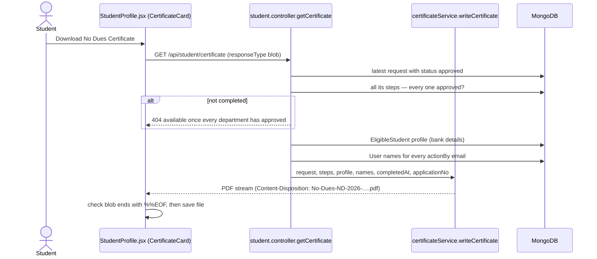
```mermaid
sequenceDiagram
    actor S as Student
    participant FE as StudentProfile.jsx (CertificateCard)
    participant C as student.controller.getCertificate
    participant P as certificateService.writeCertificate
    participant DB as MongoDB

    S->>FE: Download No Dues Certificate
    FE->>C: GET /api/student/certificate (responseType blob)
    C->>DB: latest request with status approved
    C->>DB: all its steps — every one approved?
    alt not completed
        C-->>FE: 404 available once every department has approved
    end
    C->>DB: EligibleStudent profile (bank details)
    C->>DB: User names for every actionBy email
    C->>P: request, steps, profile, names, completedAt, applicationNo
    P-->>FE: PDF stream (Content-Disposition: No-Dues-ND-2026-….pdf)
    FE->>FE: check blob ends with %%EOF, then save file
```

> **What it shows:** how the No Dues certificate PDF is produced when the student clicks Download.
>
> **Why it matters:** the certificate is generated fresh from the database each time, only when every step is approved. It uses real approver names, approval times and the student's bank details, so it can't show anything that didn't actually happen.
>
> **How to read it:** time runs downward. The `alt` box is the refusal for unfinished applications. The service then draws the paper form and streams it; the page checks the file is a complete PDF before saving it.

### 10.12 Department access management

```mermaid
flowchart TD
    A([Staff of section X or Admin]) --> B[Department Home → Access table]
    B --> ADD[Add: name + email]
    ADD --> ADD2{User with that email exists?}
    ADD2 -->|yes| ADD3[add code X to permissionCodes]
    ADD2 -->|no| ADD4[create User with code X]
    B --> ED[Edit name / email]
    ED --> ED2{User also has other sections<br/>and caller is not admin?}
    ED2 -->|yes| ED3[403 only admin can change]
    ED2 -->|no| ED4{new email used by someone else?}
    ED4 -->|yes| ED5[409 email already exists]
    ED4 -->|no| ED6[save]
    B --> RM[Remove]
    RM --> RM2[remove code X]
    RM2 --> RM3{no codes left?}
    RM3 -->|yes| RM4[delete the User]
    RM3 -->|no| RM5[save]
    ADD3 & ADD4 & ED6 & RM4 & RM5 --> EFF([Takes effect on the person's very next request<br/>— verifyToken reads permissions from DB])
```

> **What it shows:** how a department (or the admin) adds, edits and removes the people who can use that section.
>
> **Why it matters:** departments can manage their own staff without waiting for the admin, but they can't take over an account that also belongs to another section, and a person with no sections left is deleted automatically.
>
> **How to read it:** three branches: Add, Edit, Remove. The diamonds are the safety checks. All paths end in the note that the change applies on the person's very next request.

---

## 11. Business rules

| # | Rule | Where enforced |
|---|---|---|
| 1 | Only students on the Eligible Students list can sign in as Student; removing them logs them out on their next request | `auth.controller`, `verifyToken` |
| 2 | Google email must be verified | `utils/googleAuth.js` |
| 3 | Branch must be CSE / ECE / CCE / MECH (admin add, CSV import, edit, apply) | `workflowConfig.isValidBranch` |
| 4 | Every student clears **all 27 labs**; the **Kundan lab is ECE only** | `getApplicableUnitCodes` |
| 5 | A student's application goes only to **their own branch's HOD** | `getApplicableUnitCodes`, `getDependenciesForUnit` |
| 6 | Apply only with a **complete profile** (placement documents depend on placement status) | `computeProfileCompleted`, `applyForNoDues` |
| 7 | Only one unfinished application at a time | `applyForNoDues` |
| 8 | Application number `ND-<year>-<ROLL>`; a later one in the same year gets `-2`, `-3`… | `applyForNoDues` |
| 9 | Profile editable **only before applying or while On Hold**; locked during review and after completion | `getProfileLock` (backend) + Profile page |
| 10 | A step can be approved only when **all its prerequisites are approved** (single and bulk) | `unmetPrerequisites` |
| 11 | Put On Hold needs a **reason and details**; a locked or already-held step cannot be held | `rejectStep` |
| 12 | HOD, Store and Accounts **may** choose earlier departments to reset; NAD **must** choose at least one | `rejectStep` + RejectModal |
| 13 | Reset choices are limited to the step's **own upstream** departments that exist for this student (prevents deadlocks) | `rejectStep` |
| 14 | A **completed** application is **final**: it cannot be put on hold again | `rejectStep` |
| 15 | On reapply, a holder that reset others **waits for them to re-approve** before it unlocks | `reapply` + `unlockDependents` (`restartFrom`) |
| 16 | Resetting Library Staff always restarts the Librarian too | `reapply` |
| 17 | Each department sees only **its own** fields and documents | `DEPT_PROFILE_ACCESS` |
| 18 | Certificate only when **every** step is approved; offered only on the Profile page | `getCertificate` |
| 19 | Department staff can manage their own section's access; only admin can edit people who also belong to other sections | `editDepartmentAccess` |

---

## 12. API reference

Base URL: `https://noduesgravity.onrender.com/api` (local: `http://localhost:5000/api`).
All routes except `/health` and `/auth/google` need `Authorization: Bearer <JWT>`.
Errors are JSON: `{ "error": "message" }`.

### 12.1 Auth — `/api/auth`

| Method | Path | Who | Body / params | Returns |
|---|---|---|---|---|
| POST | `/google` | public | `{ credential, selectedRole }` | `{ token, user }` |
| GET | `/me` | any signed-in | — | `{ user }` |

### 12.2 Student — `/api/student` (student token)

| Method | Path | Purpose |
|---|---|---|
| GET | `/profile` | profile + `editable` lock info |
| POST | `/profile` | save profile (multipart; files: `idCardFile`, `btpReportFile`, `offerLetterFile`, `placementDeclarationFile`, `admissionLetterFile`, `examScorecardFile`, `cancelledChequeFile`) |
| GET | `/file/:fieldName` | stream own uploaded document |
| POST | `/apply` | create application + steps |
| GET | `/request` | current application |
| GET | `/request/:requestId/steps` | all steps of own application |
| GET | `/request/:requestId/logs` | timeline |
| POST | `/request/steps/:stepId/reply` | (legacy) reply to one held step, up to 5 `proofs` |
| POST | `/reapply` | reapply (`comment`, optional `reapplyFile`) |
| GET | `/reapply/proof/:stepId/:index` | own reapply proof |
| GET | `/logs/:logId/proof/:index` | document attached to a timeline entry |
| GET | `/certificate` | No Dues certificate PDF |

### 12.3 Clearance (departments) — `/api/clearance` (staff/admin token; student tokens get 403)

| Method | Path | Purpose |
|---|---|---|
| GET | `/pending?unitCode=` | pending steps of a unit |
| GET | `/approved?unitCode=` | approved steps |
| GET | `/rejected?unitCode=` | on-hold steps |
| POST | `/:stepId/approve` | approve (or move held step to approved) |
| POST | `/:stepId/reject` | put on hold `{ reason, description, restartFrom[] }` |
| POST | `/bulk-approve` | `{ stepIds[] }`; skips steps not allowed/ready |
| GET | `/:stepId/details` | step + logs |
| GET | `/:stepId/full` | "View details" data filtered for the department |
| GET | `/:stepId/file/:fieldName` | stream a permitted student document |
| GET | `/:stepId/logs/:logId/proof/:index` | document attached to a timeline entry |
| GET | `/reapply/proof/:stepId/:index` | student's reapply proof |
| GET | `/:unitCode/access` | people with access to the section |
| POST | `/:unitCode/access` | add `{ name, email }` |
| PUT | `/:unitCode/access/:userId` | edit `{ name, email }` |
| DELETE | `/:unitCode/access/:userId` | remove |

### 12.4 Admin — `/api/admin` (`admin` permission)

| Method | Path | Purpose |
|---|---|---|
| GET | `/eligible-students` | list |
| POST | `/eligible-students` | add one `{ name, email, rollNo, branch }` |
| POST | `/eligible-students/bulk` | CSV import `{ students: [...] }` → added / skipped with reasons |
| PUT | `/eligible-students/:id` | edit |
| DELETE | `/eligible-students/:id` | remove one |
| DELETE | `/eligible-students/bulk` | remove selected `{ studentIds: [...] }` |
| GET | `/staff-access` | every staff member and their codes |
| POST | `/staff-access` | add |
| PUT | `/staff-access/:id` | update |
| DELETE | `/staff-access/:id` | remove |
| GET | `/dashboard-stats` | card numbers + per-department pending/on-hold overview |
| GET | `/dashboard-details/:type` | rows behind a card: `users`, `eligible`, `profiles`, `active`, `onhold`, `completed` |
| GET | `/applications` | all applications with progress, pending at, on hold by (the page filters by status) |
| GET | `/applications/:id` | every step of one application |

### 12.5 Misc

| Method | Path | Purpose |
|---|---|---|
| GET | `/api/health` | `{ status: 'ok', timestamp }` (use it to wake Render) |

---

## 13. Security

| Threat | Protection |
|---|---|
| Stolen or forged tokens | JWT signed with a long random `JWT_SECRET` (warning at startup if shorter than 32 characters); expires after `JWT_EXPIRY` (default 15 h) |
| Access removed but token still valid | `verifyToken` re-reads the user from the DB on **every** request: deleted user, changed email, removed code or removed eligibility means an immediate 401/403 |
| Someone else's Google account | Google ID token verified against our client ID; `email_verified` must be true |
| Seeing another department's or student's data | `hasPermissionFor(step.unitCode)` on every handler; students can only read their own request; department-specific field/document filter |
| NoSQL injection (`{"$ne": null}`, `?x[$gt]=`) | `stripOperators` removes `$` and dotted keys from body, query and params; type checks such as `unitCode` must be a string |
| Malicious uploads (HTML/SVG/scripts) | only PDF/JPG/PNG where MIME type **and** extension agree; 10 MB per file; 10 files per request |
| Leaking file locations | documents streamed through the backend; logs return `proofCount` instead of URLs |
| Leaking internals | global error handler sends a generic message for 5xx |
| Clickjacking, sniffing, etc. | `helmet()` security headers |
| Cross-site calls | CORS allows only the Vercel site and `localhost:5173` |
| Dependency vulnerabilities | `qs` pinned via `overrides`; run `npm audit` in both folders from time to time |

**Secrets:** `.env` files are git-ignored. Never commit them. To rotate `JWT_SECRET` on Render,
open the service, go to **Environment**, edit `JWT_SECRET`, and click **Save Changes**. Everyone
signs in again once.

---

## 14. The No Dues certificate

Generated on demand by `BACKEND/services/certificateService.js` (pdfkit, A4). It uses the same
layout as the institute's paper form, *"STUDENT NO DUES"*:

| Part of the form | Filled with |
|---|---|
| Header | LNMIIT logo (`BACKEND/assets/LNMIIT_logo.png`, 720 px — keep it small, see [Troubleshooting](#20-troubleshooting)) |
| Application No. / Date | `ND-YYYY-ROLL` / completion date |
| "This is to certify that…" | student name, roll number, branch |
| Table rows | Accounts · Central Library · Store · LUCS · Warden In charge · Administration · Sports · Head of Department · Medical Unit · Placement Office |
| "No Dues" column | ✓ for each approved row |
| Signature of HOS | approver's **name** (from `User`, falls back to email) plus date and time of approval |
| Remarks | e.g. *Hostel BH3 vacated*, *All 28 labs and NAD Cell cleared* (labs and NAD are summarised in the HOD row, as on the paper form), *Status: Placed* |
| Registrar's Office | **Dr. Pawan Kumar Paras** with the completion date and time |
| Refund / bank section | account holder, account number, bank, branch, city, IFSC, donation, contact, father's name & mobile, address (from the profile) |
| Submitted Date | apply date |
| Signature of Student | student's name |

Times are shown in **Asia/Kolkata**. The file is named `No-Dues-<applicationNo>.pdf`.

---

## 15. Project structure (every file)

Every source file starts with a comment explaining its purpose.

```
NoDuesGravity/
├── README.md                          ← this document
├── Flowcharts.md                      earlier Mermaid flowcharts (source of the PNGs below)
├── Admin_Setup_Flow.png               ┐
├── Student_Lifecycle_Journey.png      │ rendered flowcharts for reports
├── Department_Staff_Protocol.png      │
├── Departmental_Clearance_Hierarchy.png┘
├── download_flowcharts.js             re-renders the PNGs from Flowcharts.md (mermaid.ink)
│
├── BACKEND/                           Node.js + Express API (deployed on Render)
│   ├── server.js                      entry: dotenv → connectDB → listen
│   ├── app.js                         middleware, routes, 404, error handler
│   ├── package.json / .npmrc          deps (legacy-peer-deps for multer-storage-cloudinary)
│   ├── assets/LNMIIT_logo.png         certificate logo (small on purpose)
│   ├── config/
│   │   ├── db.js                      MongoDB connection (MONGODB_URI)
│   │   ├── cloudinary.js              Cloudinary SDK
│   │   ├── multer.js                  upload rules (types, size, count) → Cloudinary
│   │   ├── permissionCodes.js         all unit codes, labels, lab groups, route↔code maps
│   │   └── workflowConfig.js          branches→HOD, labs, who applies, dependency rules
│   ├── controllers/
│   │   ├── auth.controller.js         Google sign-in → JWT
│   │   ├── admin.controller.js        eligible students, staff access, dashboard, applications
│   │   ├── clearance.controller.js    department lists, approve/hold, details, files, access mgmt
│   │   └── student.controller.js      profile, apply, track, reapply, files, certificate
│   ├── middleware/
│   │   ├── verifyToken.js             JWT + database re-check
│   │   ├── requirePermission.js       requirePermission / attachPermissionChecker
│   │   └── requireRole.js             role guard (kept for reuse)
│   ├── models/                        User, EligibleStudent, NoDuesRequest, ClearanceStep, StepActionLog
│   ├── routes/                        auth.js, admin.js, student.js, clearance.js
│   ├── services/
│   │   ├── workflowService.js         create all steps on apply
│   │   ├── dependencyEngine.js        unlock / relock / request status
│   │   └── certificateService.js      PDF certificate
│   ├── utils/
│   │   ├── googleAuth.js              verify Google ID token
│   │   └── jwt.js                     sign / verify JWT
│   └── scripts/
│       ├── reset-nodues-requests.js   wipe all applications (backup first, dry run by default)
│       └── deleteStudentRequest.js    delete one student's unfinished application
│
└── FRONTEND/NoDues/                   React + Vite SPA (deployed on Vercel)
    ├── index.html, vite.config.js, eslint.config.js, package.json
    ├── vercel.json                    SPA rewrite + Cross-Origin-Opener-Policy for the Google popup
    ├── public/vite.svg
    └── src/
        ├── main.jsx                   all routes
        ├── App.jsx                    root outlet
        ├── index.css                  Tailwind + no-scrollbar utility
        ├── api/client.js              axios instance, token, 401 handling
        ├── config/branches.js         branches → HOD (matches backend)
        ├── config/applicationNo.js    ND-YYYY-ROLL formatting
        ├── assets/                    logo, login background, tutorial screenshots (student/1–20)
        └── components/
            ├── Login.jsx, GoogleSignInButton.jsx, PrivateRoute.jsx
            ├── Header/Header.jsx                  department header (tabs, counts, logout)
            ├── Home/DepartmentHome.jsx            shared department landing
            ├── Home/DepartmentAccessManager.jsx   who can use this section
            ├── Request/PendingRequests.jsx | ApprovedRequests.jsx | RejectedRequests.jsx
            ├── Request/StudentRow.jsx, rowButton.js
            ├── Modal/  ViewDetails · Reject (Put On Hold) · Confirm · FileViewer ·
            │           Add/Edit/Remove Access · Department Add/Edit/Remove Access ·
            │           Add/Edit/Remove/BulkRemove EligibleStudent
            ├── common/HostelGuard.jsx     Warden must pick a hostel first
            ├── hooks/useDepartmentData.js fetch lists + approve/hold for unit codes
            ├── shared/DepartmentLayout.jsx
            └── pages/
                ├── student/   Layout, Home, Profile, Apply, Track, History, HowToApply
                ├── admin/     Layout, Home, DashboardDetailsModal, DepartmentAccess, EligibleStudents, Applications
                ├── medical/ sports/ store/ administration/ nad/ accounts/ warden/ placement/ LUCS/
                │              each: Layout, Home, Pending, Approved, Rejected
                ├── labs/      one set for all four lab groups (/labs/:department)
                ├── HOD/       one set for all four HODs (/hod/:department)
                └── library/   RootLayout + Staff (Home, Pending, Sent, Rejected)
                                         + Librarian (Home, Pending, Approved, Rejected)
```

---

## 16. Running locally

**Requirements:** Node.js 20+ and npm; a MongoDB Atlas database (or local MongoDB); a Cloudinary
account; a Google OAuth **Web** client ID with `http://localhost:5173` as an authorised JavaScript origin.

```bash
git clone https://github.com/amanjaiswal-07/NoDuesGravity.git
```

```bash
cd NoDuesGravity/BACKEND && npm install && npm run dev
```

The API runs on http://localhost:5000 (nodemon restarts it on changes).

```bash
cd NoDuesGravity/FRONTEND/NoDues && npm install && npm run dev
```

The site runs on http://localhost:5173.

**First admin:** the admin panel can only be opened by a user who already has the `admin` code.
For a fresh database, add one document to the `users` collection (Atlas → Browse Collections):

```json
{ "name": "Your Name", "email": "you@lnmiit.ac.in", "permissionCodes": ["admin"] }
```

Then sign in choosing **Admin** and add everyone else from the panel.

**Other commands**

```bash
cd FRONTEND/NoDues && npm run lint && npm run build
```

---

## 17. Environment variables

**`BACKEND/.env`**

| Variable | Required | Purpose |
|---|---|---|
| `MONGODB_URI` | yes | MongoDB connection string |
| `JWT_SECRET` | yes | signs login tokens. **Long and random** (48+ bytes). Generate one with `node -e "console.log(require('crypto').randomBytes(48).toString('hex'))"` |
| `JWT_EXPIRY` | no | token lifetime, default `15h` |
| `GOOGLE_CLIENT_ID` | yes | Google OAuth client ID (same as the frontend's) |
| `CLOUDINARY_CLOUD_NAME` | yes | Cloudinary account |
| `CLOUDINARY_API_KEY` | yes | 〃 |
| `CLOUDINARY_API_SECRET` | yes | 〃 |
| `PORT` | no | default `5000` (Render sets it) |

**`FRONTEND/NoDues/.env`**

| Variable | Required | Purpose |
|---|---|---|
| `VITE_API_URL` | yes | backend URL ending in `/api`, e.g. `http://localhost:5000/api` |
| `VITE_GOOGLE_CLIENT_ID` | yes | Google OAuth client ID |

`.env` files are git-ignored. Never commit them.

---

## 18. Deployment

```mermaid
flowchart LR
    DEV([Developer]) -->|git push origin master| GH[(GitHub<br/>amanjaiswal-07/NoDuesGravity)]
    GH -->|webhook| RB["Render<br/>root: BACKEND<br/>build: npm install<br/>start: npm start"]
    GH -->|webhook| VB["Vercel<br/>root: FRONTEND/NoDues<br/>build: vite build → dist"]
    RB --> RL["noduesgravity.onrender.com<br/>env: MONGODB_URI, JWT_SECRET, GOOGLE_CLIENT_ID, CLOUDINARY_*"]
    VB --> VL["no-dues-gravity.vercel.app<br/>env: VITE_API_URL, VITE_GOOGLE_CLIENT_ID"]
    VL -->|API calls| RL
```

> **What it shows:** how code gets from the developer's computer to the live site.
>
> **Why it matters:** one `git push` to `master` updates both halves: GitHub notifies Render (backend) and Vercel (frontend), each builds its own folder and publishes it with its own environment variables.
>
> **How to read it:** left to right: push → GitHub → the two build services → the two live URLs. The last arrow shows the live site calling the live API.

- **Backend (Render web service):** root directory `BACKEND`, build `npm install`, start
  `npm start` (`node server.js`). Environment variables are set under **Environment**. On the free plan the service
  sleeps when idle, so the first request after a while takes about 30–60 s.
- **Frontend (Vercel):** root directory `FRONTEND/NoDues`, framework Vite, output `dist`. `vercel.json`
  rewrites every path to `index.html` so deep links such as `/student/track` work on refresh.
- **Google Cloud Console:** add the Vercel URL (and `http://localhost:5173`) to the OAuth client's
  **Authorised JavaScript origins**.
- **CORS:** a new frontend domain must be added to the `origin` list in `BACKEND/app.js`.
- **Branch workflow used in this repo:** work on a feature branch, test, merge to `master`, push, and both deploy.

---

## 19. Maintenance scripts

Run them from `BACKEND/`. They use the database in `BACKEND/.env`, so check which database it
points to before running them.

| Command | What it does |
|---|---|
| `node scripts/reset-nodues-requests.js` | **Dry run:** reports how many applications, steps and timeline entries would be deleted |
| `node scripts/reset-nodues-requests.js --apply` | saves a JSON backup to `BACKEND/backups/`, then deletes **all** applications, steps, timeline entries and reapply proof files. Keeps students, profiles, profile documents and staff |
| `node scripts/deleteStudentRequest.js` | deletes one student's **unfinished** application and its steps so they can apply fresh. Set `STUDENT_EMAIL` at the top of the file first. **Deletes immediately (no dry run).** |

---

## 20. Troubleshooting

| Symptom | Cause / fix |
|---|---|
| First request is very slow or the login spins | Render free instance waking up; open `/api/health` and wait |
| Console: *Cross-Origin-Opener-Policy policy would block the window.postMessage call* | Comes from Google's sign-in popup itself; harmless and cannot be fixed from our side. `vercel.json` already sets `same-origin-allow-popups` |
| Console: *google.accounts.id.initialize() is called multiple times* | Fixed by `GoogleSignInButton` (initialises once); appears only if another component calls `initialize` |
| Redirected to login with "Your access has been removed" | The user's code was removed, the student was taken off the eligible list, or `JWT_SECRET` changed. Sign in again |
| Render restarts with "exceeded memory limit" when downloading the certificate | A huge logo image. Keep `BACKEND/assets/LNMIIT_logo.png` small (≈720 px wide) |
| Certificate "Failed to load PDF document" | The response was not a PDF (e.g. an error). The card checks for `%%EOF`, so look at the error message shown |
| Upload rejected | Only PDF/JPG/PNG up to 10 MB; the extension must match the file type |
| "Cannot approve yet — still waiting on …" | A prerequisite department has not approved; see the dependency table in [§8](#8-the-clearance-workflow-dependency-graph) |
| Student can't edit the profile | Locked while under review or after completion; unlocks only when On Hold |
| `npm install` peer-dependency error in BACKEND | `.npmrc` sets `legacy-peer-deps=true`; keep that file |
| A new branch (e.g. CIVIL) | Add it to `BRANCH_TO_HOD` in `workflowConfig.js`, a `hod_*` code in `permissionCodes.js`, the route in both route maps, and `FRONTEND/NoDues/src/config/branches.js` |
| Git diffs show whole files changed | Line endings: the repo uses `core.autocrlf=true`; keep a file's existing line endings |

---

## 21. Known limitations and future work

- **Email notifications** (applied, on hold, unlocked, completed) are not implemented yet.
- **Rate limiting** on the API is not implemented (consider `express-rate-limit`, especially on `/auth/google`).
- **Cloudinary files are public by URL.** The portal never reveals the URL, but anyone who
  already has one can open the file. Signed/authenticated delivery would close this.
- Some handlers still return `err.message` on 500 errors inside their own `try/catch`.
- No automated test suite is committed. Behaviour was verified with scripted API checks and manual end-to-end testing.
- `NoDuesRequest.rfidStatus` and the per-step `/reply` route are kept for compatibility but are not used by the current UI.

---

## 22. Glossary

| Term | Meaning |
|---|---|
| **Unit / unit code** | one approving desk, e.g. `medical`, `cse_lab_1`, `hod_ece` |
| **Step (ClearanceStep)** | one unit's part of one application |
| **Locked** | waiting for prerequisite departments |
| **Pending** | waiting for this department to act |
| **On Hold** | the department found an issue (stored as `rejected`) |
| **Reapply** | student responds to holds; the held (or chosen) departments review again |
| **restartFrom** | departments a holder asked to reset on reapply; afterwards it is what the re-locked holder waits for |
| **Completed** | every step approved (`status: approved`) and final |
| **Application No.** | `ND-<year>-<ROLL>`, e.g. `ND-2026-23UEC513` |
| **HOS** | Head of Section, the approver shown on the certificate |
| **NAD** | National Academic Depository cell |

---

## 23. Contributors

Thanks to the friends who contributed to this project:

<table>
  <tr>
    <td align="center"><a href="https://github.com/parth420i"><br/><b>Parth Nalwaya</b><br/>@parth420i</a></td>
    <td align="center"><a href="https://github.com/jeeninub"><br/><b>Sujal Jain</b><br/>@jeeninub</a></td>
  </tr>
</table>
